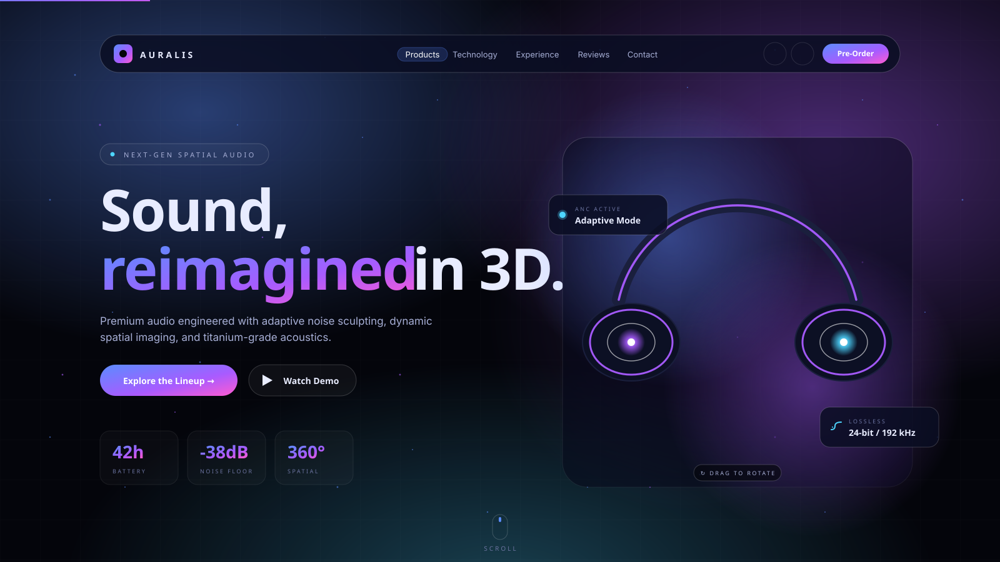

# AURALIS — Sound Reimagined

An immersive, futuristic single-page site for a fictional premium audio brand.
Dark UI, neon accents, glassmorphism, real-time 3D, and a Web-Audio-driven
reactive visualizer — built on **React + Vite + Three.js + Framer Motion**.



> The image above is a vector mockup of the hero section. To replace it with
> a real screenshot, drop a PNG at `docs/preview.png` and change the link.

---

## Features

### Visual
- Cinematic hero with a 3D headphone built from primitive geometries
  (Torus headband, Cylinder earcups, emissive neon rings)
- Three-product lineup (over-ear, earbuds, tabletop speaker) — each with its
  own 3D model and drag-to-rotate canvas
- Particle field background with mouse parallax
- Pulsing concentric `SoundRings` for the technology section
- Cursor-tracking glow, scroll-progress bar, scrollspy navigation

### Interactive
- **Drag-to-rotate** any 3D model (`OrbitControls`); auto-rotate resumes on release
- **Web-Audio synth** — click *Play Soundscape* in the Experience section to
  start a procedural pad. The particle visualizer modulates its wave amplitude
  and rotation speed against the live `AnalyserNode` RMS level
- **Mode-tinted audio** — switching Experience modes (Flight / Studio / City /
  Wilderness) re-tunes the synth base frequency and recolors the field
- **Keyboard navigation** — `←` / `→` cycle Experience modes when in view
- **Animated stat counters** in the hero
- Scroll-triggered reveals via Framer Motion's `whileInView`
- Reduced-motion friendly (`prefers-reduced-motion` disables animations + glow)

### Performance
- Each `<Canvas>` pauses (`frameloop="never"`) when scrolled off-screen via
  `IntersectionObserver`
- Device pixel ratio capped at 1.5
- Environment HDR (`drei <Environment preset="night" />`) is opt-in — only
  loaded for the canvases that have reflective metallic models
- Background gradients live on a fixed pseudo-element instead of
  `background-attachment: fixed` (which forces a per-scroll repaint)

---

## Tech Stack

| Layer | Library |
|---|---|
| Framework | **React 18** + **Vite 4** |
| 3D | **three** + **@react-three/fiber** + **@react-three/drei** |
| Animation | **framer-motion** |
| Icons | **lucide-react** |
| Audio | Native **Web Audio API** (no library) |
| Styles | **Vanilla CSS** with CSS variables (no Tailwind) |

---

## Quick Start

```bash
npm install
npm run dev      # http://localhost:5173
npm run build    # production bundle in dist/
npm run preview  # preview the production bundle
```

Requires Node.js 18+ on Windows. The `node_modules` are platform-specific —
if you switch between Windows and WSL, run `rm -rf node_modules package-lock.json && npm install` again on the new platform.

---

## Project Structure

```
src/
├── main.jsx                    React entry
├── App.jsx                     Page composition + cursor glow + scroll progress
├── index.css                   Design tokens, layout, all component styles
├── hooks/
│   └── useAudioSynth.js        Web Audio synth + AnalyserNode amplitude getter
└── components/
    ├── Navbar.jsx              Glass nav with scrollspy
    ├── Hero.jsx                3D headphone, ambient particles, animated stats
    ├── Products.jsx            Three product cards, each with its own canvas
    ├── Technology.jsx          Feature list + animated SoundRings diagram
    ├── Experience.jsx          Mode switcher + audio toggle + reactive viz
    ├── Testimonials.jsx        Floating glass review cards
    ├── Contact.jsx             Glowing-input form with simulated submit
    ├── Footer.jsx
    └── canvas/
        ├── Scene.jsx           Canvas wrapper: lighting, off-screen pause, opt-in HDR
        ├── HeadphoneModel.jsx  Torus + Cylinder + emissive rings
        ├── SpeakerModel.jsx    Stacked cylinders + glow ring
        ├── EarbudModel.jsx     Capsule stems + glow tips
        └── AudioVisualizer.jsx Particle field + SoundRings (audio-reactive)
```

---

## Design Tokens

All visual tokens live as CSS variables at the top of `src/index.css`:

```css
--neon-blue:   #5b8cff;
--neon-cyan:   #4dd5ff;
--neon-purple: #a85bff;
--neon-pink:   #ff5bd1;
--grad-primary: linear-gradient(135deg, #5b8cff 0%, #a85bff 60%, #ff5bd1 100%);
```

Override these to recolor the entire site without touching components.

---

## Swapping in Real 3D Models

The included models are stylized primitives. To use real `.glb` / `.gltf` assets:

1. Drop the file in `public/models/` (e.g. `public/models/halo.glb`)
2. In `HeadphoneModel.jsx`, replace the geometry with:
   ```jsx
   import { useGLTF } from '@react-three/drei';
   const { scene } = useGLTF('/models/halo.glb');
   return <primitive object={scene} />;
   ```
3. Optionally call `useGLTF.preload('/models/halo.glb')` at module top.

---

## Notes & Caveats

- **Audio autoplay**: browsers block `AudioContext` until a user gesture, so
  the synth only starts after clicking *Play Soundscape*.
- **Bundle size**: the production JS is ~1.17 MB / 335 KB gzipped, dominated by
  three.js. Split with dynamic imports if first-paint matters more than runtime.
- **Touch devices**: the cursor glow disables itself via `@media (hover: none)`.

---

## License

MIT — built as a portfolio / demo project.
